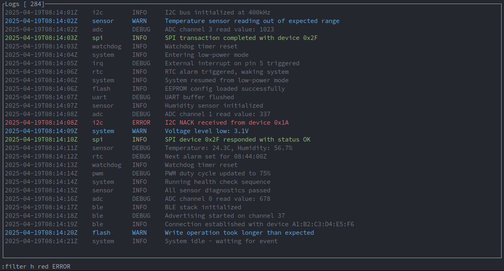
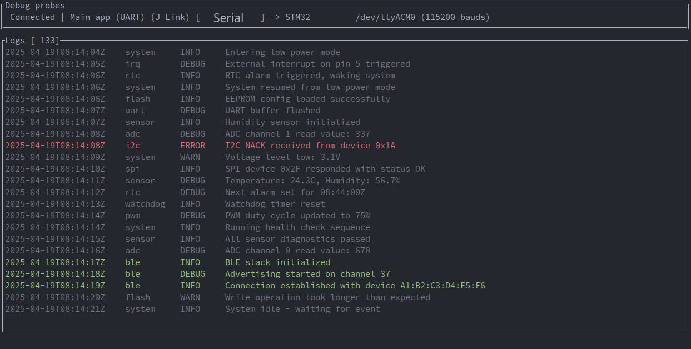
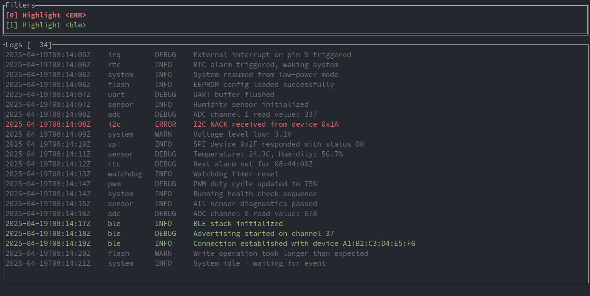

# Uberlog

An opinionated-ish embedded development tool that strives to be the next step in the `picocom` (or alternative) -> `logfile` -> `cat/grep` workflow. People working in many other areas have [fancy](https://log-viewer.opcodes.io/) [things](https://www.logviewplus.com/), but firmware engineers seem to think they have no right to have nice things. Just log the output of the serial port into a file and `grep` onto it, maybe some bash script to add a bit of coloring. **Not on my watch.**



`uberlog` does not intend to be a self contained all-around solution to your workflow, as it would be impossible to handle every specific framework. Thus it will not do anything that can be done with *nix tools, and only supports text-based logging via UART/RTT out of the box. 

If that is not the case of your project, then you need to use a different program to stream the logs of your device into a text file; `uberlog` can take that file as input and stream logs from it real-time.

## Table of Contents
- [Features](#features)
- [Usage](#usage)
  - [Configuration file](#configuration-file)
  - [Views](#views)
- [Installation](#installation)


# Features
- Vim-like commands
- Configuration with a `~/.config/uberlog.yml` file.
- User can define aliases for all commands (`:fr <expr>` instead to `:filter h red <expr>`)
- It can read logs from three different kinds of source:
    - UART
    - RTT
    - File (real time stream, sort of `tail -f`)
- As many simultaneous inputs as desired, so multi-MCU communication or server-MCU interaction can be easily understood.
- Several filtering functionalities:
    - Highlight
    - Exclude logs that contain a given expression
    - Include only logs that contain a given expression
- Reset the device
- Stream logs to a file

# Usage

The tool depends on the creation of a `.gadget.yaml` file inside the project directory that contains the information regarding your [target](https://probe.rs/targets):

```
targets:
- name: Main app (RTT)
  processor: CC2650
  log_backend: !Rtt
    elf_path: /path/to/binary.elf
  probe_id: PROBE_1_SERIAL
- name: Secondary processor (UART)
  processor: STM32F7
  log_backend: !Uart
    dev: /dev/ttyACM0
    baud: 115200
  probe_id: PROBE_2_SERIAL
```

Then you launch the tool from inside your project folder and it will parse `.gadget.yaml` know how to interact with your devices.
 
The fields are self explanatory, but note that `name` is whatever you want to name the target in the UI, and `processor` comes from `probe-rs` list of targets [link](https://probe.rs/targets). This means of course that the MCU management (flashing/reset/RTT) side of the project is done by the incredible `probe-rs` [project](https://probe.rs/). Go star it if you did not do it yet.

When the project is a bit more mature I will improve in the documentation, since it is quite prone to change, but I will always keep (famous last words) an up to date example here so you can just copy/paste and adapt it. StackOverflow style :D.

## Configuration file

The configuration file is automatically created if it does not exist. Currently only user-defined aliases are available to configure:
```yaml
# file: ~/.config/uberlog/config.yaml
alias_list:
- alias: :fy
  expanded: :filter h yellow
- alias: :fr
  expanded: :filter h red
- alias: :fe
  expanded: :filter e
```

## Views

When the program is executed it shows the General view, a (currently) empty screen in which the logs are shown and vim-like commands can be issued. The normal workflow from here is to press `P` (mind the uppercase) to go to the Log source view (previously `P`robes, hence the `P`) and configure at least one input. You can exit your current view with `ESC`. 

### General view


Most commands can be issued from here, they are vim-like in that they start with `:` and are shown in the bottom line. Available commands in the general view are:

- `:filter i <keyword>` : filter out all logs that do not include `<keyword>`
- `:filter e <keyword>` : filter out all logs that include `<keyword>`
- `:filter h <color> <keyword>` : highlight in `<color>` all logs which contain `<keyword>`. Available colors are: `red`, `green`, `yellow`, `white`, `blue`, `magenta`.
- `:stream_in <path>` : start streaming data from the file defined by `path`.
- `:stream_out <path>` : stream the logs to `path`
- `:stream_out_stop` : stop streaming logs to the path given with `:sstream`

Keybindings:
- `g` : go to top of logs
- `G` : go to bottom of file
- `/` : search for a keyword (vim style)
- `C` : clear screen
- `q` : quit
- `s` : show source id
- `t` : show timestamp
- `n` / `N` : go to next/previous instance of the keyword last searched for with `/`

Navigation:
- `F` -> Go to `F`ilter view
- `P` -> Go to Log source view
- Arrow keys / PageUp / PageDown work as one would expect

### Log source view



In this view `uberlog` will report the debug probes defined in the `.gadget.yml` file that are connected to the PC, the user can select any of them and `c`onnect to it. It will instantly begin reading logs and showing them in the `Logs` section.

Keybindings:
- `c`onnect : start reading logs from the probe
- `d`isconnect : stop reading longs from the probe
- `r`efresh : refresh the list of detected probes
- `R`eset : issue a reset to the target

### Filter view



This view has two main purposes. The first one is that it gives the user an overview of the existing filters, every entry showing:

- Index of the filter
- Kind of the filter
- Keyword attached to the filter.  Notice that in case of highlight filters, the information is displayed in the color associated to it. 

The second one is that the user can navigate the filter list with the arrow keys and `d`elete the selected filter (the one with bold text).

# Installation

You can just download the latest release [binary](https://github.com/Dlozanof/uberlog/releases), please note that only linux is supported, I just added windows and mac because it was easy enough; but I have no means to test them.

Otherwise, assuming you have [Rust](https://www.rust-lang.org/tools/install) in your computer you can just:

```
cargo install --path .
```

And have your binary available in `$HOME/.cargo/bin/uberlog`. From this point you can do whatever you want to make the app available. Typically adding `$HOME/.cargo/bin` to your `$PATH`. But if you are reading this chances are you have a different way to managing binaries.
